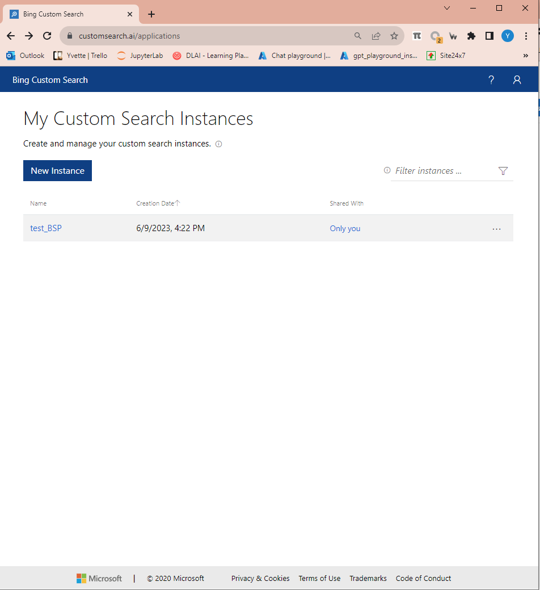

Bing Custom Search API lets you build a focused search engine that returns results only from domains you trust. Instead of the entire web, you define a curated set of sites. This sharpens relevance, improves compliance, and makes answers faster and cleaner for your users. It’s ideal for internal knowledge portals, customer-facing help centers, and vertical search experiences where control matters more than breadth.

Compared to general Bing Web Search, you get domain scoping, ranking controls, pinned results, and filters you can tune without code. You’ll create two things: 
1. a **Custom Bing Search instance**,  
   where you configure domains and rules
2. an **Azure Bing Search resource**,  
   which provides keys, quotas, and enterprise-grade management. 

You’ll then call an endpoint that includes your customConfig ID and your subscription key.

## Architecture at a Glance
- Custom Search Instance (customsearch.ai): Define domains, filters, safe search, pinned results, and refinements.
- Azure Bing Resource: Holds your API keys, pricing tier, region, and monitoring.
- Call Flow: Client → Bing endpoint (/v7.0/custom/search) → Uses customConfig to apply your instance settings → Returns scoped results.
- Consumers: Web apps, bots (like PVA), back-end services, or low-code flows.


## Prerequisites & Access

- Azure subscription with permissions to create resources.
- Access to Bing Custom Search portal (customsearch.ai) to create and edit your instance.
- RBAC setup (Owner/Contributor) for your resource group.
- Region & pricing tier chosen based on expected traffic.
- Security: Plan for secret storage (Azure Key Vault) and rotation.


## Create a Custom Bing Search Instance
1. add an instance in **custom bing search**
    
    [Bing Custom Search](https://www.customsearch.ai/application/2fb5152d-594b-40bd-95ee-c28d9caeceda/prod/endpoint)
    
    
    
    .png)
    
    add domain to search on

## Register the Azure Bing Resource

2. register a **Bing Custom Search** in azure subscription
    
    [](https://portal.azure.com/#@TrendMicro.onmicrosoft.com/resource/subscriptions/847a5749-fae0-42df-a6f0-d943651bcbd9/resourceGroups/Workshop_2/providers/Microsoft.Bing/accounts/test_BSP/overview)
    
    .png)
    
## Connect Custom Config to Azure
3. access the azure resource
    - use this endpoint, the endpoint in the sample code is not working
        ```
        https://api.bing.microsoft.com/v7.0/custom/search?q=@{triggerBody()['text']}&customconfig=5ffcd700-1ab8-4382-8c77-32bc455916e0&mkt=en-US
        ```
        
        replace the custom config with that in **custom bing search**
        
        .png)
        
    - Send the search key in the header
        
        `Ocp-Apim-Subscription-Key: <azure bing search key>`
        .png)


## Conclusion

With a well-tuned Bing Custom Search API setup—custom instance, Azure resource, correct endpoint, and secure headers—you’ll deliver focused, trustworthy results from approved sources. Add PVA for conversational access, monitor usage, and keep domains/rules current. The result is faster answers, better compliance, and a smoother user experience for your audience.


## ßHelpful External Resource
- Microsoft Docs: Bing Custom Search — feature overview, setup, and API reference: https://learn.microsoft.com/bing/search-apis/bing-custom-search/overview